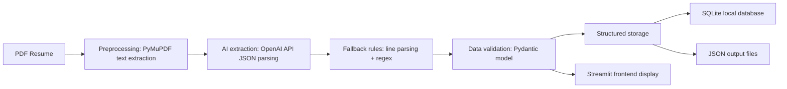

# Take-Home Case Study: Resume Parsing

## 1. Use Case Definition

### Objective and Background

This project solves the problem of extracting structured data from PDF resumes in recruitment workflows. Target users include hiring teams, HR integration providers, and consulting firms that need to automatically capture candidate name, contact data, skills, education, and experience.

### Input Documents and Output Pattern

- Input: text-based PDF resumes
- Output: structured JSON and local SQLite database records

Output fields:

- `name`: candidate name
- `email`: email address
- `phone`: phone number
- `skills`: list of skills
- `education`: list of education entries
- `experience`: list of work experience entries
- `confidence`: extraction confidence score

### Business Value

These details are often manually read, copied, and entered into recruiting systems:

- manual entry is time-consuming and error-prone
- resume layouts vary widely, increasing standardization costs
- automation can increase throughput from dozens to hundreds per day and reduce data quality risks

### Evaluation Metrics

- extraction accuracy: whether key fields are mapped correctly
- processing efficiency: time per resume (seconds)
- batch capability: support multi-file upload and save
- data quality: required field validation, normalized naming, consistent formats

## 2. Architecture and Design

### 2.1 Overall Architecture



### 2.2 Technology Decisions and Alternatives

- Python: main implementation language, suited for the case study
- PyMuPDF: PDF text extraction for text-based resumes
- OpenAI API: cloud-based LLM (gpt-4o-mini) for accurate JSON extraction
- Pydantic: structured schema validation for output fields
- SQLite: lightweight local persistence for fast validation
- Streamlit: quick interactive demo interface

Alternatives:

- OCR + Tesseract: for scanned image PDF resumes
- Azure Document Intelligence: production-grade document AI
- Local LLMs (Ollama, Llama2): for offline processing without API costs
- PostgreSQL / Cosmos DB: enterprise storage options

### 2.3 Azure Mapping

| Local Component | Azure Production Equivalent |
|---|---|
| PDF files | Azure Blob Storage |
| OpenAI API | Azure OpenAI Service |
| SQLite | Azure SQL Database / Azure Cosmos DB |
| local JSON files | Azure Data Lake Storage |
| Streamlit | Azure App Service / Azure Static Web Apps |

### 2.4 Layout Variants and Adaptation

- Use regex and heading matching to detect multiple field variants (e.g. Experience, Work Experience, Education, Degrees)
- Support comma, semicolon, and newline separators for skill lists
- Trigger local rule fallback if the LLM output is inconsistent

## 3. AI Parsing and Implementation

### 3.1 Implementation Approach

- Use OpenAI API (gpt-4o-mini) to parse resume text and return strict JSON
- Fall back to local heuristic parsing on API failure
- Validate results with the `Resume` Pydantic model
- Generate a `confidence` score for result reliability

### 3.2 Confidence and Validation

- `confidence` is based on key field completeness (name, email, skills, experience)
- Missing required fields lower the score
- Streamlit displays warnings and errors where appropriate

## 4. Transformation and Storage

### 4.1 Cleaning and Standardization

- Normalize skills, education, and experience into arrays
- Clean phone numbers into digits with optional plus sign
- Normalize blank values and missing fields

### 4.2 Storage Strategy

- Local SQLite database
- JSON structured output files

### 4.3 Database Schema Notes

- `name`, `email`: required fields
- `skills`, `education`, `experience`: JSON array text
- `confidence`: extraction confidence
- `raw_json`: full original structured result
- `raw_text`: original PDF text

## 5. Code Quality and Operations

- Clear project structure: `src/`, `tests/`, `docs/`, `sample_data/`
- Environment variable support: `.env` / `.env.example`
- Error handling: log PDF read failures and return error messages
- Type hints, docstrings, and modular design

## 6. Run and Test

```bash
pip install -r requirements.txt
streamlit run streamlit_app.py
```

Run tests:

```bash
python -m pytest -q
```

## 7. Sample Data

The `sample_data/` folder contains example PDF resumes for quick validation.
